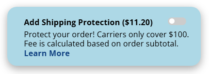

# MIVA Store Shipping Insurance Project

**NOTE:** This repo is meant to serves as a reference for a client's existing store. You can try to use this project on your own for your store though it might not meet all your specific needs.  A developer would be required for the install. If you want me to install this feature on your store or have any inquiry please reach out to me at jvillacoding@gmail.com. Thank you!

## Overview
This project sets out to create a UI that allows customer to easily add shippping protection to their order at multiple points in their shopping session and to dynamically update the shipping protection fee as they add or remove items from their order.

### High Level Overview

1. `UPS_DECLARED_VALUE_MACHINE.mv` calculates the UPS Declared Value Fee and checks if the fee already exists in the customers basket.
2. `toggle_component.html` uses this information to populate the toggle switches data attributes. 
3. `ups-dv-toggle-handler.js` sends the AJAX GET request with all the toggle switch's data attributes when the customer clicks the toggle switch.
4. `API_Page.mv` processes the request parameters (toggle switch data attributes). If they are valid, then the it either add, update, or delete the UPS DV fee. If not then it will send error information.
5. `Shipping_Insurance_front_end.js` will receive this data and will update the UI as needed.
6. If the customer makes changes to their basket then `UPS_DECLARED_VALUE_MACHINE.mv` will see that their is a mismatch between the calculated fee and the fee in the basket. In this case it will update the fee.

---

## Every component explained

### UPS_DECLARED_VALUE_MACHINE.mv

**Where should this be added on the website?**

This file should be added as a Theme Component Content Section and the component is called in the global header and specifically in the BASK page in the AJAX section. The reason for this is because 

**What does this file do?**
1. **Calculates UPS Declared Value Fee** 

    It calculates this based on the subtotal before any discounts. This way the full value of the products can be covered. If the subtotal is below $100 then it is covered by the standard UPS liability of loss so the fee is $0. If it is between $100.01 and $300 then it is a flat rate of $4.85. For anything greater than $300, the fee is calculated rounding up the subtotal to its next 100. Once the fee is calculated it is stored in `l.settings:ship_ins_cost`. 

    This changes yearly. To find up to date information click [here](https://www.ups.com/assets/resources/webcontent/en_US/retail_rates.pdf)

2. **Tracks State of the Fee** 
    
    It uses BasketChargeList_Load_Type() on page load to check the customer's basket for a charge with the type of SHIPPING_INSURANCE. If it succeeds and the function find it then `l.settings:ship_ins_isactive` is set to 1 (state is active) if not then it is set to 0 (state is not active). If it is found then that charge structure (MIVA equivalent of an javascript object) is saved to `l.settings:UPS_DV_charge`

3. **Updates current charge**

    To check if there is a change in the basket, it checks to see if the UPS DV charge is active and if the the calculated cost is equal to the the current amount being charged. If they are the same this means that no change has occurred so no update is required. If they don't match then it deletes the current charge and checks if the calculated fee is more than 0. If it is more than zero then it create a new charge that equals the calculated fee. If the calculated charge equal zero that means no new charge need to be created so it moves on to the next step. Finally it will reload all charges so all the charge information is up to date on the UI.

**Variables**

```xml
l.settings:ship_ins_cost -------- calculated UPS Declared Value Fee

l.settings:ship_ins_isactive ----- holds the state of the fee

l.settings:UPS_DV_charge --------- holds SHIPPING_INSURANCE charge.

l.settings:UPS_DV_max_charge ------ this is calculated by taking the maximum allowable subtotal and mulitplies by the UPS rate percentage. This gives the maximum allowable charge

```

---

### toggle_component.htm

**Where should this be added on the website?**

This file should be added as a Theme Component Content Section and the component is called wherever you want the toggle to be placed. In our store it is called in the minibasket, ORDL and BASK page. 

**What does this file do?**

1. **Initializes Data Attributes**

    It sets the toggle switch's data attributes. These include `data-rqst_mode` (request mode), `data-shipping_cost` (Calculated UPS DV cost), `data-current_charge` (current UPS DV fee in basket) `data-current_total` (current basket total). The data attributes used for the GET request are put into the structure: `l.settings:UPS_DV_reqst_param`.

    data-

    Note: `data-current_total` is the only data attribute that isn't sent during the GET request. It is used to update the UI. More on this in `ups-dv-toggle-handler.js`. 

2. **Contains the Toggle switch itself**

    This only holds the toggle switch not the surrounding element like in BASK. See Picture below. It has a class name divToggle. This is used to identify every instance of it on the page using `ups-dv-toggle-handler.js`. 

    

**Associated CSS**

I used this css for the toggle switch. This is located in `theme-styles` css resource.

```css
    /* ---------- Toggle Switch------------ */
    .toggle-wrapper {
      display: inline-block;
      position: relative;
      width: 35px;
      height: 15px;
      background-color: #ccc;
      border-radius: 34px;
      cursor: pointer;
      transition: background-color 0.4s;
    }

    .toggle-circle {
      position: absolute;
      height: 10px;
      width: 10px;
      left: 3px;
      bottom: 3px;
      background-color: white;
      border-radius: 50%;
      transition: transform 0.4s;
    }

    .toggle-wrapper.active {
      background-color: #408b34;
    }

    .toggle-wrapper.active .toggle-circle {
      transform: translateX(19px);
    }

    .toggle-wrapper.loading {
      background-color: #c0c0c0 !important;
      cursor: not-allowed;
      opacity: 0.6;
    }

    .u-hidden-important{
      display: none!important;
    }

```

**MIVA Variables**


```xml
    l.settings:UPS_DV_rqst_param:rqst_mode ----------------- "request mode". This can have the values of add, delete, and update.

    l.settings:UPS_DV_rqst_param:ship_in_cost -------------- "Shipping Insurance Cost". This is the calculated amount to be charged for the customer's current basket.

    l.settings:UPS_DV_rqst_param:current_charge ------------ "Current Charge". This is the existing charge in the customers basket.

    l.settings:UPS_DV_rqst_param:max_ship_ins_cost --------- "Maximum Allowable Shipping Insurance Cost". This is the maximum allowable shipping insurance cost.

```

---

### ups-dv-toggle-handler.js

This takes into account toggle switches that are loaded dynamically (after page load). This only happens when a customer does an ajax add-to-cart and it automatically opens the mini-basket. It delegates the event binding to the mini-basket itself. For toggle switches that are loaded statically (at page load) the event binding is on the toggle itself. 

**Where should this be added on the website?**

This file should be added as a javascript resource, set to global and active and added to the footer_js resource group.

**What does this file do?**

1. **Sends GET request to update UPS DV charge in basket**

    It assigns the toggle switch's data attributes to request parameters and then sends them with a GET request to `API_Page.mv` which has the url `/shipping-insurance-api.html`. 

2. **Updates UI**

    Once it receives a response from the API, it updates the Line item in the main basket, the total in the main basket (BASK only), the total in the mini basket (global), and the toggle switch state (on/off). 

3. **Prevents Spam clicking**

    It put the toggle switch into a loading state once clicked, making it unusable until the whole script is done (after the UI is updated).

---

### API_Page.htm

This page receives toggle data attribute through url parameters from the GET request. They are stored on this page in global variable. They include:

```xml
g.ship_insurance_cost
g.current_charge
g.rqst_mode
g.max_ship_ins_cost
```

**Where should this be added on the website?**

This is should added as a page. The canonical url should be `/shippings-insurance-api.html`. You can put a different url but you would have to change the url in `ups-dv-toggle-handler.js`. The page code used was `shipping-insurance-api` but it can by anything you want without changing anything else.

**What does this file do?!**

1. **Validates request data**

    Before it attempts to make changes to the charge, this validates the parameters for the following
    
    - Shipping Insurance cost must be withing the allowable range. (0 < shipping insurance cost <= maximum allowable shipping insurance cost)
    - Current charge must be greater than zero.
    - request mode must be one of the allowable values: "add", "delete" or "update"
    - AJAX value must be set to 1.
    - All parameters must be sent. These include: request mode, shipping insurance cost, current charge, and maximum allowable shipping cost.

2. **Adds, Deletes and Updates Shipping Insurance Fee**

    After validating the parameters, it adds, deletes or updates the charge depending on what mode it is on.

3. **Sends status code and message and error status code and message**

    It returns an array of json objects. Each object has a status code and a status message. If there is no error with validation then the array only contains one object. Its only when there is an error when there is more than one object. The reason it always returns an array is to allow `ups-dv-toggle-handler.js` to handle the response data in a single method rather than two separate methods (one for a single object and another for an array of objects).

    If a status code starts with S it indicates that the request was successful. If it starts with an E then that indicates that there was an error with the request. The message clearly states what the api page did or what went wrong with your request.  

    Below is a list of all possible repsonses. 

    ```json

        // SUCCESSFUL CASES

        [{
            status_code: 'S1',
            message : 'Charge Added Successfully'
        }]

        [{
            status_code: 'S2',
            message : 'Charge Removed Successfully'
        }]

        [{
            status_code: 'S3',
            message : 'Charge Updated Successfully'
        }]

        // UNSUCCESSFUL CASES

        [{
            status_code: 'E0',
            message : 'ERROR - Charge Must Be Greater Than 0'
        }]

        [{
            status_code: 'E1',
            message : 'ERROR - Subtotal too large. Contact Sales for insurance options.'
        }]

        [{
            status_code: 'E2',
            message : 'ERROR - Current charge is less than 0. Charge Deleted.'
        }]

        [{
            status_code: 'E3',
            message : 'ERROR - Invalid Request Mode'
        }]

        [{
            status_code: 'E4',
            message : 'ERROR - Missing One Or More Request Parameters'
        }]

        // CATCH-ALL ERROR MESSAGE
        [{
            status_code : "Unknown Error",
            message : "Unexpected Error"
        }]

    ```

    4. **Debug Mode**
    
    The is a debug mode if you pass through `debug=1` as a url parameter. It returns all validation checks and their values in an object. It would look like this;

    ```json
        {
        "rqst_params_isvalid": &mvtj:rqst_params_isvalid;,
        "ship_cost_isvalid": &mvtj:ship_cost_isvalid;,
        "current_charge_isvalid": &mvtj:current_charge_isvalid;,
        "rqst_mode_isvalid": &mvtj:rqst_mode_isvalid;
        }
    ```

## Changes in existing template code

